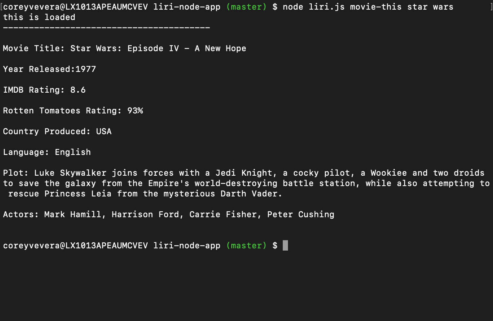

# liri-node-app

## App Overview
The LIRI (Language Interpretation and Recognition Interface) accepts a number of commands that give the user back data in the console.

## Our LIRI app preforms four funtions:
* Concert Lookup (command: concert-this):
Liri takes a band or artist and returns five relevant selections of concert venue information back to the user through the Bands In Town Artist API.
* Spotify Song Lookup (command: spotify-this-song):
Liri takes a song and returns five relevant selections of information about the artist, album, and includes a preview link to the song.
* Movie Lookup (command: movie-this):
Liri take a movie and returns information about where and when the movie was produced, ratings from various review websites, a plot summary, and the star actors.
* Do What It Says (command: do-what-it-says):
Liri reads a command and parameter from a random.txt and returns the relevant information.

## Overall App Structure
Liri is a simply node.js app that uses switch cases to identify the command to run, and then runs the relevant function to console.log the relevant data. Liri uses the Bands in Town Artist API, the Spotify API, and the OMBD API accessed through npm packages. Additionally, we use the fs package to read the random.txt file for "do-what-it-says" and to write all data to the log.txt file.

## App Instructions
*To run LIRI, simply run the file (node liri.js), type a command (concert-this, spotify-this-song, movie-this, or do-what-is-says), and add a parameter.

## Here's what the console logs if we run "concert-this Taylor Swift":

## Here's what we get when we run "spotify-this-song Mean":

## Here's what shows when we run "movie-this Star Wars":

## And here's what logs when we run "do-what-it-says":

